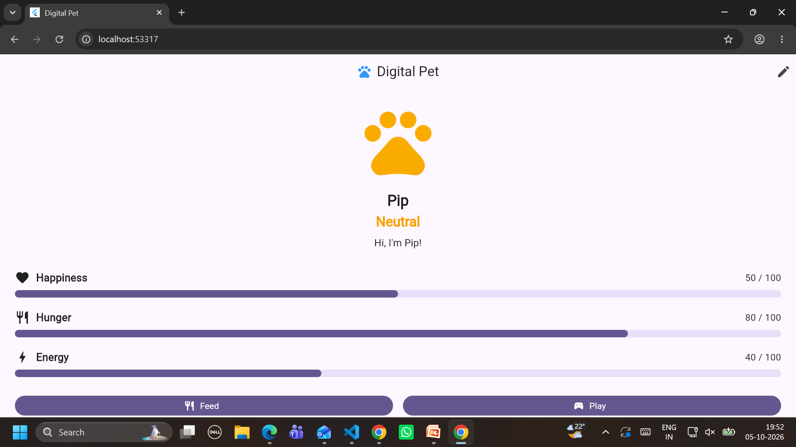
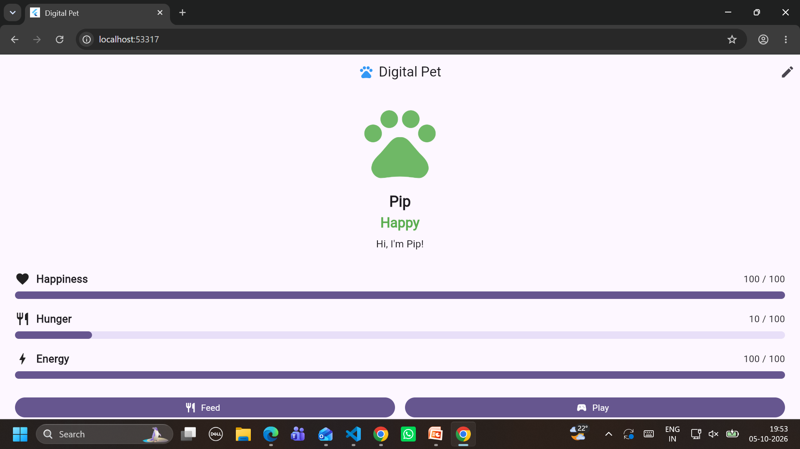
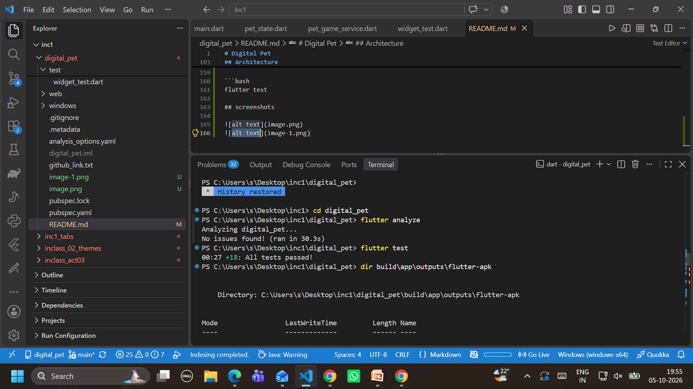

# Digital Pet

## Project Overview

Digital Pet is a Flutter mobile application where users take care of a virtual pet by managing its happiness, hunger, and energy.

The application demonstrates state management, timed state changes, user interactions, animations, accessibility, automated testing, and separation of game logic from UI rendering.

## Features

- Display pet happiness from 0–100
- Display pet hunger from 0–100
- Display pet energy from 0–100
- Editable pet name
- Feed the pet
- Play with the pet
- Run activity
- Sleep activity
- Automatic hunger increase every 30 seconds
- Mood changes based on happiness
- Mood-based pet color tint using `ColorFiltered`
- Animated pet scaling
- Animated pet messages
- Reduced-motion accessibility support
- Win condition
- Loss condition
- Reset functionality
- Automated unit and widget tests

## Game Rules

### Happiness

Happiness is maintained between 0 and 100.

- Happiness above 70: Happy
- Happiness from 30 to 70: Neutral
- Happiness below 30: Unhappy

### Hunger

Hunger is maintained between 0 and 100.

Every 30 seconds:

- Hunger increases by 5
- Energy decreases by 5
- If hunger is already 100 and another timer tick occurs, happiness decreases by 20

### Feed

Feeding the pet:

- Decreases hunger by 10
- Normally increases happiness by 10
- If the resulting hunger is below 30, happiness decreases by 20

### Play

Playing:

- Increases happiness by 10
- Increases hunger by 5
- Decreases energy by 10

Play requires at least 10 energy.

### Run

Running:

- Increases happiness by 15
- Increases hunger by 10
- Decreases energy by 25

Run requires at least 25 energy.

### Sleep

Sleeping:

- Increases happiness by 5
- Decreases hunger by 5
- Increases energy by 30

All meters are clamped between 0 and 100.

## Win Condition

The player wins when happiness remains above 80 continuously for 3 minutes.

If happiness falls to 80 or below, the win timer is cancelled.

## Loss Condition

The game ends when:

- Hunger reaches 100
- AND happiness is 10 or lower

After the game ends, game actions are disabled.

## Architecture

The application separates game rules from UI rendering.

```text
lib/
├── main.dart
├── models/
│   └── pet_state.dart
├── services/
│   └── pet_game_service.dart
└── screens/
    └── pet_screen.dart


## Advanced Features

This project implements the following Graduate pathway advanced features:

1. Animated pet feedback
   - The pet uses AnimatedScale to provide visual feedback during interaction.

2. Animated mood/message changes
   - AnimatedSwitcher and TweenAnimationBuilder are used to animate changes in the pet's mood and feedback messages.

3. Accessibility and reduced motion
   - The application checks MediaQuery.of(context).disableAnimations and reduces animation behavior when reduced motion is enabled.

## Feature-to-Outcome Rubric Map

| Feature | Implementation | Outcome |
|---|---|---|
| Happiness and hunger meters | PetState and PetScreen | Users can monitor the pet's current state |
| Mood classification | Happy, Neutral, and Unhappy thresholds | Pet behavior is visually understandable |
| ColorFiltered mood tint | Mood-dependent color filter | Pet appearance reflects happiness |
| Editable pet name | Name editing dialog | User can personalize the pet |
| Feed interaction | PetGameService.feed() | Hunger and happiness change according to game rules |
| Play interaction | PetGameService.play() | Happiness, hunger, and energy change |
| Run interaction | PetGameService.run() | Additional activity with energy cost |
| Sleep interaction | PetGameService.sleep() | Energy recovery and state changes |
| Hunger timer | 30-second periodic timer | Pet state changes automatically over time |
| Win timer | Three-minute happiness timer | Sustained high happiness produces a win |
| Loss condition | Hunger 100 + happiness <= 10 | Poor pet care produces a loss |
| Reset | PetGameService.reset() | Game can be restarted |
| Meter clamping | PetState.copyWith() | Values remain between 0 and 100 |
| Automated tests | Unit and widget tests | Game rules and state transitions are verified |
| Separation of concerns | PetState, PetGameService, PetScreen | Game rules are separated from UI rendering |
| Reduced motion | MediaQuery accessibility check | Animations can be reduced for accessibility |

## Testing

The project includes automated tests for the pet game rules and application behavior.

### Test Command

Run:

```bash
flutter test

## screenshots



